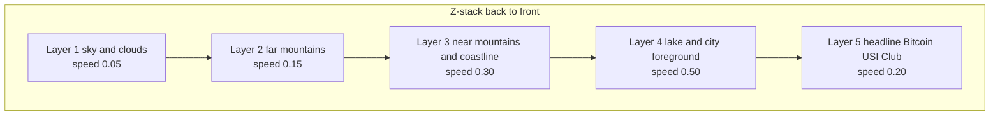

# Layered parallax hero — implementation plan

Replace the current single-photo hero in [`src/components/HomePage.astro`](../src/components/HomePage.astro) with a 4-layer parallax hero (sky / far mountains / near mountains / lake-foreground) cut from the existing Lugano photo, driven by [Lenis](https://github.com/darkroomengineering/lenis) smooth-scroll for a [premai.io](https://www.premai.io/)-style feel.

> **Note**: image-cutting is done manually outside the app. This document specifies the expected asset deliverables and the code work to wire them up.

---

## Reference & current state

- **Reference**: [premai.io](https://www.premai.io/) hero — Lenis smooth-scroll + RAF transforms moving stacked DOM layers at different rates (not `background-attachment: fixed`).
- **Current hero**: [`src/components/HomePage.astro`](../src/components/HomePage.astro) lines 52–85 (single `#hero-bg` div, one flat photo, single-speed parallax via the inline script lines 376–392).
- **Current source image**: [`public/images/orientamento-correzione_obiettivo_-_9.jpg`](../public/images/orientamento-correzione_obiettivo_-_9.jpg), referenced from [`src/data/config.json`](../src/data/config.json) as `images.hero` (string).

---

## Layer composition



Speeds are translateY multipliers applied to `lenis.scroll`; later (foreground) layers move faster, creating depth. Tune speeds during QA.

---

## 1. Asset deliverables (manual cut, dropped into `public/images/hero/`)

Each layer must be **inpainted behind the layers in front of it** so no holes appear when the layers separate on scroll. Aspect ratio of each PNG/WebP should roughly match the original photo, with **~20% extra vertical bleed** above and below the visible area so translation never exposes the file edge.

| File | Content | Transparency | Approx. size |
| --- | --- | --- | --- |
| `hero-sky.webp` (+ `.jpg` fallback) | Sky + distant haze | None — back layer | ~2400×1400 |
| `hero-mountains-far.webp` (+ `.png` fallback) | Far mountain ridge silhouette | Transparent above the ridge | ~2400×900 |
| `hero-mountains-near.webp` (+ `.png` fallback) | Near hills + town strip | Transparent above the silhouette | ~2400×700 |
| `hero-lake.webp` (+ `.png` fallback) | Lake surface + foreground city | Transparent above the waterline | ~2400×900 |

Combined budget: keep total weight under **~450 KB** (WebP quality ~75, PNG only as fallback).

---

## 2. Dependencies

```bash
npm install lenis
```

`lenis` is ~9 KB gzip, MIT-licensed, framework-agnostic. Same library premai.io uses.

---

## 3. Config + types

Update [`src/data/config.json`](../src/data/config.json) — change `images.hero` from a string to an object:

```json
"images": {
  "logo": "images/pos_hub_logo.jpeg",
  "hero": {
    "sky": "images/hero/hero-sky.webp",
    "mountainsFar": "images/hero/hero-mountains-far.webp",
    "mountainsNear": "images/hero/hero-mountains-near.webp",
    "lake": "images/hero/hero-lake.webp"
  }
}
```

Propagate the type change through [`src/data/siteData.ts`](../src/data/siteData.ts) and update the consumer in [`src/components/HomePage.astro`](../src/components/HomePage.astro) (line 40 currently reads `site.images.hero` as a string).

---

## 4. New component: `src/components/HeroParallax.astro`

Extract the hero from `HomePage.astro` into its own component for clarity. Renders the 5 stacked layers as absolutely-positioned `<div>`s inside a `relative overflow-hidden` section sized at `min-h-[100svh]`. Each image layer uses `<picture>` with WebP + raster fallback, `loading="eager"`, and `fetchpriority="high"` on the sky layer.

Skeleton:

```astro
---
import { withBase } from "../utils/withBase";
import type { SiteData } from "../data/siteData";

interface Props { site: SiteData; lang: "it" | "en"; }
const { site, lang } = Astro.props;
const asset = withBase;
const en = lang === "en";
const { sky, mountainsFar, mountainsNear, lake } = site.images.hero;
---

<section id="hero" class="relative overflow-hidden min-h-[100svh]" aria-label={site.brand.title}>
  <div data-parallax data-speed="0.05" class="hero-layer" aria-hidden="true">
    
  </div>
  <div data-parallax data-speed="0.15" class="hero-layer" aria-hidden="true">
    
  </div>
  <div data-parallax data-speed="0.30" class="hero-layer" aria-hidden="true">
    
  </div>
  <div data-parallax data-speed="0.50" class="hero-layer" aria-hidden="true">
    
  </div>

  <div class="absolute inset-0 bg-black/35" aria-hidden="true"></div>

  <div data-parallax data-speed="0.20" class="relative z-10 flex h-full w-full items-end px-6 pb-20 md:px-16">
    <div>
      <h1 class="text-6xl font-black uppercase leading-none tracking-tight text-white drop-shadow-xl md:text-8xl lg:text-9xl">
        {site.brand.title}
      </h1>
      <p class="mt-4 text-base font-semibold tracking-wide text-white/65 drop-shadow md:text-lg">
        {en
          ? "First Bitcoin University Club in Switzerland · USI · Lugano"
          : "Primo Bitcoin University Club in Svizzera · USI · Lugano"}
      </p>
    </div>
  </div>

  <div class="absolute bottom-0 left-0 right-0 h-40 bg-gradient-to-t from-white to-transparent" aria-hidden="true"></div>
</section>

<style>
  .hero-layer { position: absolute; inset: -10% 0; will-change: transform; }
  .hero-layer img { width: 100%; height: 100%; object-fit: cover; object-position: center; }
</style>
```

Then in [`src/components/HomePage.astro`](../src/components/HomePage.astro) replace lines 52–85 (the inline `<section>`) with:

```astro
<HeroParallax site={site} lang={lang} />
```

…and remove the inline parallax `<script>` block at lines 376–392.

---

## 5. Smooth-scroll + parallax init

Add a single global module script. Recommended: new `src/components/SmoothScroll.astro` mounted once in [`src/layouts/Layout.astro`](../src/layouts/Layout.astro) just before `<slot />` closes (so it ships site-wide).

```astro
---
// src/components/SmoothScroll.astro
---
<script>
  import Lenis from "lenis";

  const reduce = window.matchMedia("(prefers-reduced-motion: reduce)").matches;
  if (!reduce) {
    const lenis = new Lenis({ lerp: 0.1, smoothWheel: true });
    const layers = document.querySelectorAll<HTMLElement>("[data-parallax]");

    lenis.on("scroll", ({ scroll }: { scroll: number }) => {
      for (const el of layers) {
        const speed = parseFloat(el.dataset.speed || "0");
        el.style.transform = `translate3d(0, ${scroll * speed}px, 0)`;
      }
    });

    const raf = (time: number) => {
      lenis.raf(time);
      requestAnimationFrame(raf);
    };
    requestAnimationFrame(raf);
  }
</script>
```

Notes:

- This must be a module `<script>` (no `is:inline`) so Astro bundles the `lenis` import.
- When `prefers-reduced-motion: reduce` is on we skip Lenis entirely; layers stay static, page uses the browser's native scroll.
- The existing scroll-spy in [`src/components/SiteHeader.astro`](../src/components/SiteHeader.astro) (lines 252–381) and the smooth-anchor scrolling already in place keep working — Lenis dispatches real `scroll` events on `window` and the `IntersectionObserver` continues to fire normally.
- If mobile parallax feels jittery during QA, gate the parallax block (not Lenis itself) behind `window.matchMedia("(min-width: 768px)").matches`.

---

## 6. Accessibility & SEO

- One `<h1>` only (already the case).
- All layer `` elements get `alt=""` and the wrapping layer gets `aria-hidden="true"` (decorative).
- The `<section>` keeps `aria-label={site.brand.title}`.
- Respect `prefers-reduced-motion` (handled in §5).

---

## 7. Cleanup

- Remove the inline parallax `<script>` block at the bottom of [`src/components/HomePage.astro`](../src/components/HomePage.astro) (lines 376–392) once `HeroParallax.astro` + the new init script handle it.
- Drop `site.images.hero` string handling at line 40 of `HomePage.astro` since the hero now reads the layered object directly inside `HeroParallax.astro`.
- The original [`public/images/orientamento-correzione_obiettivo_-_9.jpg`](../public/images/orientamento-correzione_obiettivo_-_9.jpg) can be kept as a backup until the cut layers are validated, then deleted to slim the repo.

---

## Resource checklist

- [ ] 4 transparent layered images (WebP + raster fallback) under `public/images/hero/` — produced manually
- [ ] `lenis` npm dep added
- [ ] `images.hero` in [`src/data/config.json`](../src/data/config.json) reshaped from string to object
- [ ] `SiteData` type updated in [`src/data/siteData.ts`](../src/data/siteData.ts)
- [ ] New component `src/components/HeroParallax.astro`
- [ ] Edit [`src/components/HomePage.astro`](../src/components/HomePage.astro) to use `<HeroParallax />` and drop the inline parallax script
- [ ] New `src/components/SmoothScroll.astro` mounted in [`src/layouts/Layout.astro`](../src/layouts/Layout.astro)
- [ ] QA: reduced-motion fallback, mobile behavior, scroll-spy still works, no horizontal overflow, image edges hidden during scroll
